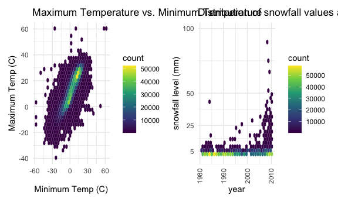

P8105\_HW3\_dg3187
================
Danyang Gui

### Problem 0

This “problem” focuses on structure of your submission, especially the
use git and GitHub for reproducibility, R Projects to organize your
work, R Markdown to write reproducible reports, relative paths to load
data from local files, and reasonable naming structures for your files.

### Problem 1

``` r
data("instacart")
```

This dataset contains 1384617 rows and … columns.

Observations are the level of items in orders by user. There are user /
order variables – user ID, order ID, order day, and order hour. There
are also item variables – name, aisle, department, and some numeric
codes.

How many aisles, and which are most items from?

``` r
instacart %>% 
    count(aisle) %>% 
    arrange(desc(n))
```

    ## # A tibble: 134 x 2
    ##    aisle                              n
    ##    <chr>                          <int>
    ##  1 fresh vegetables              150609
    ##  2 fresh fruits                  150473
    ##  3 packaged vegetables fruits     78493
    ##  4 yogurt                         55240
    ##  5 packaged cheese                41699
    ##  6 water seltzer sparkling water  36617
    ##  7 milk                           32644
    ##  8 chips pretzels                 31269
    ##  9 soy lactosefree                26240
    ## 10 bread                          23635
    ## # … with 124 more rows

Let’s make a plot

``` r
instacart %>% 
    count(aisle) %>% 
    filter(n > 10000) %>% 
    mutate(
        aisle = factor(aisle),
        aisle = fct_reorder(aisle, n)
    ) %>% 
    ggplot(aes(x = aisle, y = n)) + 
    geom_point() + 
    theme(axis.text.x = element_text(angle = 90, vjust = 0.5, hjust = 1))
```


Let’s make a table\!\!

``` r
instacart %>% 
    filter(aisle %in% c("baking ingredients", "dog food care", "packaged vegetables fruits")) %>% 
    group_by(aisle) %>% 
    count(product_name) %>% 
    mutate(rank = min_rank(desc(n))) %>% 
    filter(rank < 4) %>% 
    arrange(aisle, rank) %>% 
    knitr::kable()
```

| aisle                      | product\_name                                 |    n | rank |
| :------------------------- | :-------------------------------------------- | ---: | ---: |
| baking ingredients         | Light Brown Sugar                             |  499 |    1 |
| baking ingredients         | Pure Baking Soda                              |  387 |    2 |
| baking ingredients         | Cane Sugar                                    |  336 |    3 |
| dog food care              | Snack Sticks Chicken & Rice Recipe Dog Treats |   30 |    1 |
| dog food care              | Organix Chicken & Brown Rice Recipe           |   28 |    2 |
| dog food care              | Small Dog Biscuits                            |   26 |    3 |
| packaged vegetables fruits | Organic Baby Spinach                          | 9784 |    1 |
| packaged vegetables fruits | Organic Raspberries                           | 5546 |    2 |
| packaged vegetables fruits | Organic Blueberries                           | 4966 |    3 |

Apples vs ice cream..

``` r
instacart %>% 
    filter(product_name %in% c("Pink Lady Apples", "Coffee Ice Cream")) %>% 
    group_by(product_name, order_dow) %>% 
    summarize(mean_hour = mean(order_hour_of_day)) %>% 
    pivot_wider(
        names_from = order_dow,
        values_from = mean_hour
    )
```

    ## `summarise()` regrouping output by 'product_name' (override with `.groups` argument)

    ## # A tibble: 2 x 8
    ## # Groups:   product_name [2]
    ##   product_name       `0`   `1`   `2`   `3`   `4`   `5`   `6`
    ##   <chr>            <dbl> <dbl> <dbl> <dbl> <dbl> <dbl> <dbl>
    ## 1 Coffee Ice Cream  13.8  14.3  15.4  15.3  15.2  12.3  13.8
    ## 2 Pink Lady Apples  13.4  11.4  11.7  14.2  11.6  12.8  11.9

### Problem 2

Import and clean the data, create a new varible indicating whether the
specific day is weekday or weekend.

``` r
accel_df = 
  read_csv ("./data/accel_data.csv") %>%
  janitor::clean_names() %>%
  pivot_longer(
    activity_1:activity_1440,
    names_to = "minute",
    values_to = "activity_count",
    names_prefix = "activity_"
  ) %>%
  mutate(
    day = as.factor(day),
    week = as.factor(week),
    minute = as.numeric(minute),
    activity_count = as.numeric(activity_count),
    weekday_or_weekend = 
      case_when(
        day %in% c("Saturday", "Sunday") ~ "Weekend",
        day %in% c("Monday", "Tuesday", "Wednesday", "Thursday", "Friday") ~ "Weekday"))
```

    ## Parsed with column specification:
    ## cols(
    ##   .default = col_double(),
    ##   day = col_character()
    ## )

    ## See spec(...) for full column specifications.

There are 50400 rows and 6 columns in the existing dataframe now.
Variables include week, day\_id, day, minute, activity\_count,
weekday\_or\_weekend.

``` r
 accel_df  %>% 
  group_by(week, day) %>% 
  summarize(
    sum_activity_count = sum(activity_count)
  ) %>% 
  pivot_wider(
    names_from = day,
    values_from = sum_activity_count
  ) %>% 
  relocate(week, Monday, Tuesday, Wednesday, Thursday, Friday, Saturday, Sunday) %>%
  knitr::kable(digits = 2) 
```

    ## `summarise()` regrouping output by 'week' (override with `.groups` argument)

| week |    Monday |  Tuesday | Wednesday | Thursday |   Friday | Saturday | Sunday |
| :--- | --------: | -------: | --------: | -------: | -------: | -------: | -----: |
| 1    |  78828.07 | 307094.2 |    340115 | 355923.6 | 480542.6 |   376254 | 631105 |
| 2    | 295431.00 | 423245.0 |    440962 | 474048.0 | 568839.0 |   607175 | 422018 |
| 3    | 685910.00 | 381507.0 |    468869 | 371230.0 | 467420.0 |   382928 | 467052 |
| 4    | 409450.00 | 319568.0 |    434460 | 340291.0 | 154049.0 |     1440 | 260617 |
| 5    | 389080.00 | 367824.0 |    445366 | 549658.0 | 620860.0 |     1440 | 138421 |

This produces a 7\*5 table. Saturdays of week 4 and 5 show exceptionally
low activity level. Week 1 Monday was low too. The activity level for
Week 3 Monday was really high.

``` r
accel_df %>% 
  group_by(week, day_id) %>%
  ggplot(aes(x = minute, y = activity_count, color = day, alpha = .7)) + 
  geom_line() +
  theme(legend.position = "right") +
  stat_smooth(se = F,
              geom ="line"
            ) +
  labs(
    title = "24-hour activity plot",
    x = "Hour",
    y = "Activity Level") + 
  scale_x_continuous(
    breaks = c(0,240, 480, 720, 960, 1200, 1440),
    labels = c("0:00", "4:00", "8:00", "12:00", "16:00", "20:00", "24:00")) + 
  scale_y_continuous(
    trans = "sqrt") +
  viridis::scale_color_viridis(discrete = T, name = "Day")
```

    ## `geom_smooth()` using method = 'gam' and formula 'y ~ s(x, bs = "cs")'


In general, the activity level starts to increase after 6:00 and starts
to decrease after 22:00. Friday is kinda special: there’s an increase in
activity level starting from 20:00.

### Problem 3

``` r
library(p8105.datasets)
data("ny_noaa")
```

``` r
tidy_ny = 
  ny_noaa %>%
  separate(date, c("year", "month", "day"), sep = "([-])") %>% 
  mutate(month = as.numeric(month),
         day = as.numeric(day),
         year = as.numeric(year),
         tmax = 0.1 * as.numeric(tmax),
         tmin = 0.1 * as.numeric(tmin),
         prcp = 0.1 * as.numeric(prcp),
         snow = as.numeric(snow),
         snwd = as.numeric(snwd)) %>%
  mutate(
      snow = case_when(
      snow <0 ~ 0,
      snow >= 0 ~ snow))
```

``` r
ny_noaa %>%  
  count(snow == "0")
```

    ## # A tibble: 3 x 2
    ##   `snow == "0"`       n
    ##   <lgl>           <int>
    ## 1 FALSE          205447
    ## 2 TRUE          2008508
    ## 3 NA             381221

2008508 out of 2595176 of the observations have value 0 for the snowfall
variables and 381221 out of 2595176 are NA. Firstly because NY is known
to snow in winter only (not all the year). Secondly, snowfall and snow
depth are redundant. Sometimes it does snow but the value is recorded
under Snow depth(snwd) instead of Snowfall(snow).

``` r
skimr::skim_without_charts(tidy_ny %>% select(-id))
```

|                                                  |                           |
| :----------------------------------------------- | :------------------------ |
| Name                                             | tidy\_ny %\>% select(-id) |
| Number of rows                                   | 2595176                   |
| Number of columns                                | 8                         |
| \_\_\_\_\_\_\_\_\_\_\_\_\_\_\_\_\_\_\_\_\_\_\_   |                           |
| Column type frequency:                           |                           |
| numeric                                          | 8                         |
| \_\_\_\_\_\_\_\_\_\_\_\_\_\_\_\_\_\_\_\_\_\_\_\_ |                           |
| Group variables                                  | None                      |

Data summary

**Variable type: numeric**

| skim\_variable | n\_missing | complete\_rate |    mean |     sd |     p0 |    p25 |    p50 |    p75 |  p100 |
| :------------- | ---------: | -------------: | ------: | -----: | -----: | -----: | -----: | -----: | ----: |
| year           |          0 |           1.00 | 1996.50 |   9.19 | 1981.0 | 1988.0 | 1997.0 | 2005.0 |  2010 |
| month          |          0 |           1.00 |    6.56 |   3.45 |    1.0 |    4.0 |    7.0 |   10.0 |    12 |
| day            |          0 |           1.00 |   15.73 |   8.80 |    1.0 |    8.0 |   16.0 |   23.0 |    31 |
| prcp           |     145838 |           0.94 |    2.98 |   7.82 |    0.0 |    0.0 |    0.0 |    2.3 |  2286 |
| snow           |     381221 |           0.85 |    4.99 |  27.22 |    0.0 |    0.0 |    0.0 |    0.0 | 10160 |
| snwd           |     591786 |           0.77 |   37.31 | 113.54 |    0.0 |    0.0 |    0.0 |    0.0 |  9195 |
| tmax           |    1134358 |           0.56 |   13.98 |  11.14 | \-38.9 |    5.0 |   15.0 |   23.3 |    60 |
| tmin           |    1134420 |           0.56 |    3.03 |  10.40 | \-59.4 |  \-3.9 |    3.3 |   11.1 |    60 |

``` r
fig = 
  tidy_ny %>%
  filter(month %in% c("1", "7")) %>%
  group_by(id, year, month) %>%
  summarize(mean_tmax = mean(tmax, na.rm = TRUE)) %>%
  drop_na() %>% 
  ggplot(aes(x = year, y = mean_tmax, group = id, color = id)) +
  geom_point() +
  geom_path() +
  theme(legend.position = 'none') +
  facet_grid(. ~ month) +
  labs(
    title = "Mean average temperature for January and July across stations and years", 
    x = "year", 
    y = "average maximum temperature (C)") +
  theme(axis.text.x = element_text(angle = 90, vjust = 0.5, hjust = 1))
```

    ## `summarise()` regrouping output by 'id', 'year' (override with `.groups` argument)

``` r
fig
```


For January, the average maximum temperature varied between -10 degree
to 10 degree with two extremely cold year below -10 degree which was
consistently observed across stations. Two outliers below -10 degree
were shown in the graph. For July, the average maximum temperature
varied between 20 degree to 35 degree. Four outliers below 20 degree
were shown in the graph.

There were fluctuations of average temperature across these 3 decades
but overall trending was not strictly increasing or decreasing.

``` r
fig_1 =
  tidy_ny %>%
  drop_na(tmin, tmax) %>% 
  ggplot(aes(x = tmin, y = tmax)) +
  geom_hex() +
  theme(legend.position = 'right') +
  labs(
    title = "Maximum Temperature vs. Minimum Temperature", 
    x = "Minimum Temp (C)", 
    y = "Maximum Temp (C)") +
    viridis::scale_color_viridis(
    name = "Location",
    discrete = TRUE)


fig_2 =
  tidy_ny %>%
  filter(between(snow, 0, 100),!is.na(snow)) %>% 
  group_by(year,id) %>%
  summarize(mean_snow = mean(snow, na.rm = TRUE), group = id, color = id) %>%
  ggplot(aes(x = year, y = mean_snow)) +
    geom_hex() +
    theme(legend.position = 'right') + 
    labs(
    title = "Distribution of snowfall values across years", 
    x = "year", 
    y = "snowfall level (mm)") +
    viridis::scale_color_viridis(
    name = "Location",
    discrete = TRUE) +
  theme(axis.text.x = element_text(angle = 90, vjust = 0.5, hjust = 1)) +
  scale_y_continuous(breaks = c(5,25,50,100),
                     limits = c(0,100))
```

    ## `summarise()` regrouping output by 'year', 'id' (override with `.groups` argument)

``` r
fig_1 + fig_2    
```

    ## Warning: Removed 30 rows containing missing values (geom_hex).


